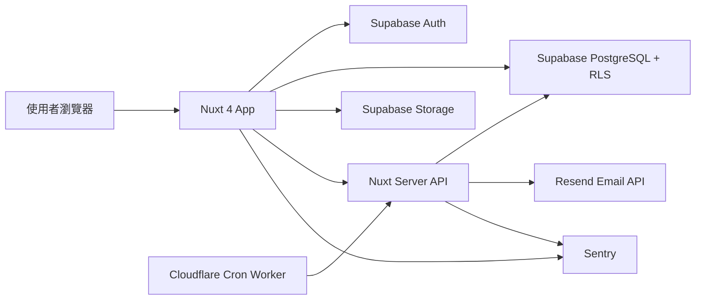

# 庫存管理系統

一個以 Nuxt 4、TypeScript、Supabase 與 Cloudflare Workers 建立的全端庫存管理作品。  
專案目標是把日常庫存管理做成真正可使用的 Web App：支援登入、分類管理、物品建檔、條碼掃描、圖片上傳、庫存異動追蹤、低庫存提醒與 Email 通知。

正式網站：<https://inventory.3854335.com>

## 專案重點

- 使用 Nuxt 4 + Vue 3 + TypeScript 建立前後端整合式應用
- 使用 Supabase Auth、PostgreSQL、Storage 與 Row Level Security 管理資料與權限
- 使用 TanStack Query 管理 server state，降低重複請求並提升資料同步體驗
- 使用 Cloudflare Workers Cron Trigger 定時觸發每日低庫存檢查
- 使用 Resend 寄送低庫存 Email 通知
- 使用 Sentry 監控前端與 server 端錯誤，包含已被共用錯誤流程 catch 的操作錯誤
- 使用 Chart.js / vue-chartjs 呈現庫存統計圖表
- 使用 ZXing 實作條碼掃描與圖片條碼解析
- 使用 Vitest 撰寫重點邏輯測試

## 功能介紹

### 使用者與權限

- Email / 密碼登入與註冊
- Google OAuth 登入
- Supabase Auth session 管理
- Supabase RLS 隔離不同使用者的資料
- 使用者可自行設定是否每天接收低庫存通知

### 庫存管理

- 新增、編輯、刪除庫存物品
- 設定數量、低庫存門檻與低庫存提醒開關
- 依大類別、小類別、位置、群組整理物品
- 支援條碼輸入、即時掃描與圖片條碼解析
- 支援圖片上傳、壓縮與預覽
- 支援 Excel 匯出

### 分類與資料設定

- 管理大類別與小類別
- 管理物品位置
- 管理物品群組
- 分類、位置、群組可獨立新增、編輯與刪除

### 異動紀錄

- 記錄物品建立、更新與刪除
- 更新物品時記錄實際變更欄位
- 首頁顯示近期 7 天異動
- 異動紀錄頁提供分頁瀏覽

### 低庫存通知

- 首頁可手動寄送目前登入使用者的低庫存通知
- 使用者可設定是否接收每日低庫存通知
- Cloudflare Worker 可定時觸發全站低庫存檢查
- Server API 使用 `INVENTORY_CRON_SECRET` 驗證排程請求
- Resend 負責寄送低庫存 Email

### 監控與錯誤處理

- 使用 Sentry 監控未捕捉錯誤
- 共用 `runSafely` / `safelyRun` 流程會將 catch 到的操作錯誤送到 Sentry
- 使用統一錯誤 code 對應 i18n 顯示文字
- Toast 顯示成功、錯誤、提醒與警告訊息

## 技術架構



## 技術棧

### Frontend

- Nuxt 4
- Vue 3
- TypeScript
- Nuxt UI
- Tailwind CSS
- Pinia
- pinia-plugin-persistedstate
- TanStack Query for Vue
- @nuxtjs/i18n
- Chart.js
- vue-chartjs

### Backend / Data

- Nuxt Server API
- Supabase Auth
- Supabase PostgreSQL
- Supabase Storage
- Supabase Row Level Security
- Supabase Service Role
- Resend
- Cloudflare Workers Cron Trigger
- Sentry

### Barcode / Image

- @zxing/browser
- @zxing/library
- browser-image-compression

### Tooling / Quality

- pnpm
- ESLint
- @antfu/eslint-config
- vue-tsc
- Vitest
- Husky

## 專案結構

```txt
app/
  components/          共用元件與庫存表單
  composables/         前端狀態、資料讀取、圖片處理、掃描與錯誤處理
  layouts/             頁面版型
  pages/               首頁、登入頁與後台頁面
  plugins/             Supabase、TanStack Query plugin
  services/            Supabase 資料存取 service
  stores/              Pinia store

config/                UI、查詢 key、Email、條碼、圖片、錯誤、異動紀錄等設定
server/
  api/                 Nuxt Server API
  utils/               server-only 工具與 Email 流程
types/                 共用 TypeScript 型別
utils/                 前端與共用工具函式
tests/                 Vitest 單元測試
supabase-schema.sql    Supabase schema、index、trigger、RLS policy
```

## 資料表設計

主要資料表定義在 `supabase-schema.sql`，新環境可以直接貼到 Supabase SQL Editor 建立。

| Table | 用途 |
| --- | --- |
| `categories` | 大類別與小類別，使用 `parent_id` 建立階層 |
| `locations` | 物品存放位置 |
| `item_groups` | 物品群組 |
| `items` | 庫存物品主資料 |
| `inventory_logs` | 物品建立、更新、刪除異動紀錄 |
| `user_settings` | 使用者偏好設定，例如每日低庫存通知 |

所有主要資料表都包含 `user_id`，並透過 Supabase RLS policy 限制使用者只能讀寫自己的資料。

## 環境變數

請先複製 `.env.example`：

```powershell
Copy-Item .env.example .env
```

### Nuxt / Vercel

| 變數 | 說明 |
| --- | --- |
| `SUPABASE_URL` | Supabase project URL |
| `SUPABASE_KEY` | Supabase anon key，前端使用，搭配 RLS 控制資料存取 |
| `SUPABASE_SERVICE_ROLE_KEY` | Server API 使用的 service role key，只能放在 server-side environment |
| `INVENTORY_CRON_SECRET` | Nuxt API 與 Cloudflare Worker 之間的排程驗證密鑰 |
| `RESEND_API_KEY` | Resend API key |
| `LOW_STOCK_FROM_EMAIL` | 低庫存通知寄件人，例如 `Inventory <notify@example.com>` |
| `NUXT_PUBLIC_SITE_URL` | 正式網站網址，例如 `https://inventory.3854335.com` |
| `SENTRY_DSN` | Server-side Sentry DSN |
| `NUXT_PUBLIC_SENTRY_DSN` | Client-side Sentry DSN |
| `NUXT_PUBLIC_SENTRY_ENABLED` | 是否啟用 Sentry，正式環境可設為 `true` |

### Cloudflare Worker

Worker 專案需要設定：

| 變數 | 說明 |
| --- | --- |
| `INVENTORY_APP_URL` | Nuxt App 網址 |
| `INVENTORY_CRON_SECRET` | 必須與 Nuxt 專案相同 |

## 本地開發

安裝依賴：

```powershell
pnpm install
```

啟動開發伺服器：

```powershell
pnpm dev
```

預設網址：

```txt
http://localhost:3000
```

## Supabase 建置步驟

1. 建立 Supabase project
2. 到 SQL Editor 執行 `supabase-schema.sql`
3. 建立 Supabase Storage bucket，用於物品圖片
4. 設定 Auth providers，例如 Email / Password 與 Google
5. 將 Supabase URL、anon key、service role key 放入 `.env`

## Resend 設定步驟

1. 在 Resend 建立 API key
2. 驗證寄件網域
3. 設定 `RESEND_API_KEY`
4. 設定 `LOW_STOCK_FROM_EMAIL`

如果要使用自訂網域寄信，Resend 的網域狀態必須完成驗證。

## Cloudflare Worker 排程

每日低庫存通知由獨立的 Cloudflare Worker 觸發。  
Worker 會在排程時間呼叫 Nuxt Server API，並帶上 `INVENTORY_CRON_SECRET` 驗證請求來源。

Nuxt API 會：

1. 驗證 cron secret
2. 查詢所有啟用低庫存提醒的物品
3. 依使用者設定判斷是否寄信
4. 使用 Resend 寄出低庫存通知

## 常用指令

```powershell
pnpm dev
pnpm lint
pnpm typecheck
pnpm test
pnpm build
```

## 測試

目前使用 Vitest 測試重點邏輯：

- 低庫存 Email 內容與收件流程
- 低庫存物品查詢邏輯
- 庫存異動欄位轉換邏輯

執行測試：

```powershell
pnpm test
```

## 安全性設計

- 前端只使用 Supabase anon key
- 使用 Supabase RLS 限制使用者只能存取自己的資料
- `SUPABASE_SERVICE_ROLE_KEY` 只在 Nuxt Server API 使用
- 排程 API 使用 `INVENTORY_CRON_SECRET` 驗證
- Resend API key 只放在 server-side environment
- Sentry 可透過 `NUXT_PUBLIC_SENTRY_ENABLED` 控制是否啟用
